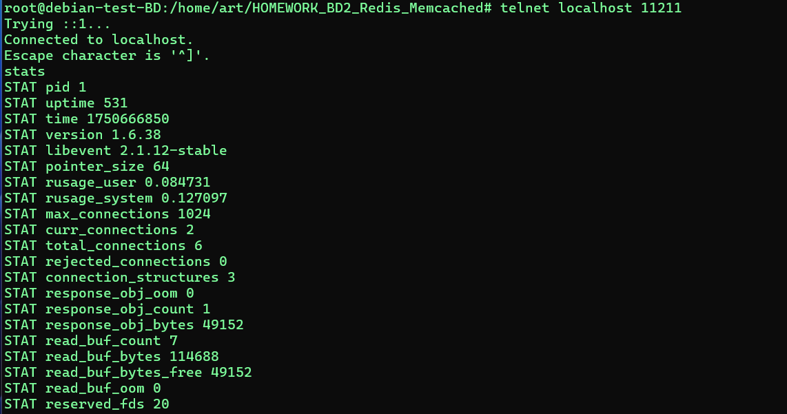

# Задание 1. Кеширование
Приведите примеры проблем, которые может решить кеширование в БД


### Кеширование — это временное хранение часто запрашиваемых данных в быстродоступном хранилище (например, в оперативной памяти), чтобы снизить нагрузку на базу данных и ускорить работу приложения.

1. Высокая нагрузка на БД (Read Heavy)
Проблема: Частые SELECT-запросы к одной и той же таблице (например, популярные товары в интернет-магазине) создают нагрузку на БД, замедляя работу системы.
Решение: Кеширование результатов запросов (например, в Redis или Memcached) снижает количество обращений к БД.

2. Медленные сложные запросы
Проблема: Агрегации (COUNT, SUM, GROUP BY), JOIN-запросы или аналитические выборки выполняются долго.
Решение: Кеширование результатов (например, раз в 5 минут) ускоряет ответ без пересчёта.

3. Проблемы с масштабированием
Проблема: При увеличении числа пользователей БД становится узким местом.
Решение: Кеширование распределяет нагрузку, уменьшая запросы к основной БД.

4. Нестабильная работа при пиковых нагрузках
Проблема: Резкий рост запросов (например, во время распродажи) приводит к таймаутам или ошибкам.
Решение: Кеш принимает на себя часть нагрузки, стабилизируя систему.

5. Избыточные запросы к редко меняющимся данным
Проблема: Данные, которые редко обновляются (например, список городов или категорий товаров), запрашиваются тысячи раз в день.
Решение: Кеширование таких данных на несколько часов или дней.

6. Медленные ответы при географически распределённых пользователях
Проблема: Задержки из-за удалённости сервера БД (например, пользователи из США и Азии).
Решение: CDN или распределённый кеш (например, Redis Cluster) ускоряет доступ.

7. Проблемы с блокировками при высокой конкурентности
Проблема: Много одновременных запросов на чтение блокируют таблицы, мешая записи.
Решение: Кеширование снижает количество обращений к БД, уменьшая блокировки.

Примеры кеширования
Redis / Memcached — для хранения сессий,热门数据, результатов запросов.

Query Cache (в MySQL) — кеширование результатов SQL-запросов.

ORM-кеширование (например, в Django, Hibernate).

Кеширование страниц (Varnish, Nginx).

### Вывод: Кеширование снижает нагрузку на БД, ускоряет работу приложения и улучшает

# Задание 2. Memcached
Установите и запустите memcached.

## ответ
```
docker run --name test_cache -p 11211:11211 -d memcached
```
проверим работу

```
docker ps
echo "stats" | nc localhost 11211
```


пробуем telnet

```
telnet localhost 11211
stats
```


тест


# Задание 3. Удаление по TTL в Memcached
Запишите в memcached несколько ключей с любыми именами и значениями, для которых выставлен TTL 5.


я сделал 30 сек

# Задание 4. Запись данных в Redis
Запишите в Redis несколько ключей с любыми именами и значениями.

Через redis-cli достаньте все записанные ключи и значения из базы, приведите скриншот этой операции.


запускаем контейнер в фоне
```
docker run --name test-redis -d redis
```


```
docker exec -it test-redis redis-cli
```


## Задание 5*. Работа с числами
Запишите в Redis ключ key5 со значением типа "int" равным числу 5. Увеличьте его на 5, чтобы в итоге в значении лежало число 10.

Приведите скриншот, где будут проделаны все операции и будет видно, что значение key5 стало равно 10.

